# Invites.cc: MVP Design Document

> **Less Chat. More Get-Togethers. One Link is All You Need**
> Tired of organizing group hangouts through endless chats and DMs? Invites is purpose-built tool for bringing people together–without the noise and confusion.
> Organize in-person gatherings with friends, colleagues, teammates, classmates–any group–quickly and easily.
> Plan all activities, from casual hangouts to group outings and trips, in one place and share instantly using one simple link–for your group.

----

This document outlines the design and implementation plan for the Minimum Viable Product (MVP) of *Invites.cc*, a tool designed to simplify the organization of group hangouts and events.

## Motivation

Organizing and tracking group gatherings is often cumbersome and inefficient, relying on fragmented communication across various chat platforms and direct messages. This leads to:

- Chat Overload**:** Drowning in notifications and irrelevant messages while trying to nail down the details.
- Scattered Information: Event details (What? When? Where? Who's coming?) are dispersed across multiple chats, making it hard to keep track of everything.
- Confusion and Missed Information: Important details get lost in the noise, leading to misunderstandings and logistical issues.

Invites.cc offers a breath of fresh air – a simple, focused platform for organizing group events, centered around the idea of a “Link”—a dedicated, clutter-free space for each group to plan their events.

The MVP focuses on enabling users to quickly create shared spaces ("Links"), invite members, organize basic events within those spaces, and manage RSVPs. While intentionally lean, the MVP is architected with future extensibility in mind, laying the foundation for scalable storage, search, monitoring, and Google Calendar synchronization.

## Proposed Solution

### Features

#### User

1. **Google Sign-In**: Users can seamlessly sign in to Invites.cc using their existing Google accounts.

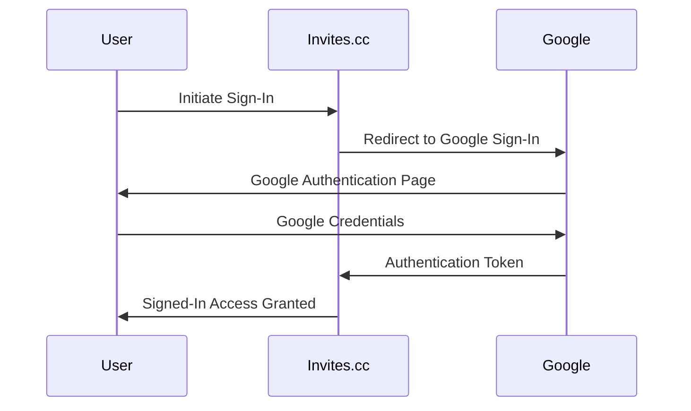

#### Link

2. **Link Creation**: Signed-in users can create new Links, which serve as shared spaces for organizing events. The creator automatically becomes the Link Admin, possessing administrative privileges.

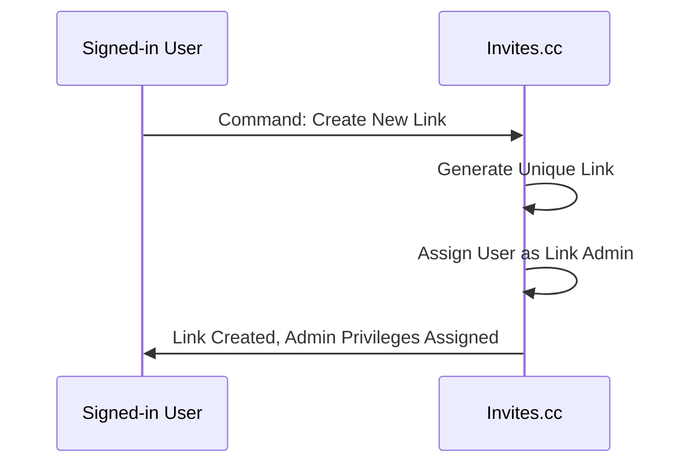

3. **Member Invitation via Tokens**: Link Admins can generate unique, revocable invitation tokens. These tokens are used to invite new members to join the Link.

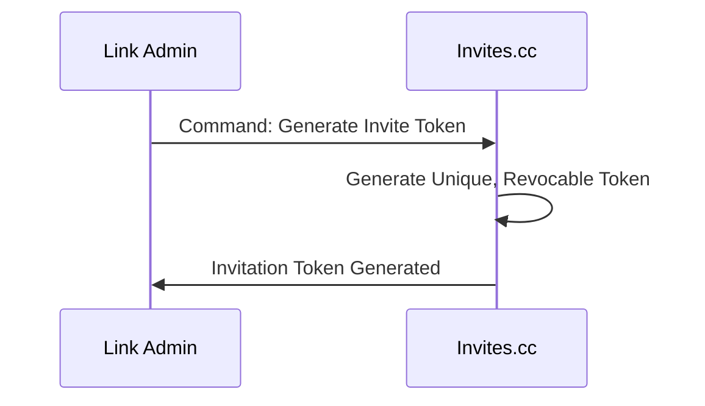

4. **Member Token Revocation**: Link Admins can revoke previously generated invitation tokens. Revoked tokens become invalid, preventing further Link joins.

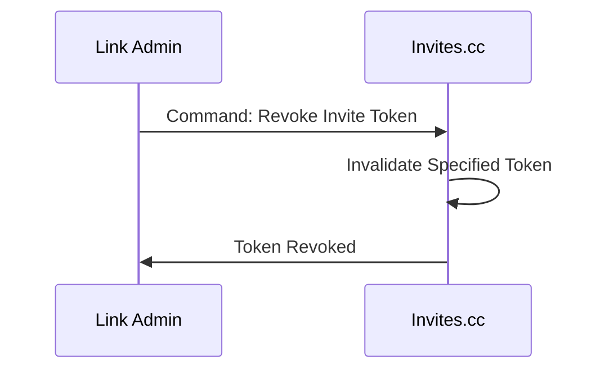

5. **Member Removal**: Link Admins can remove existing members from a Link, immediately restricting their access to the Link and its events.

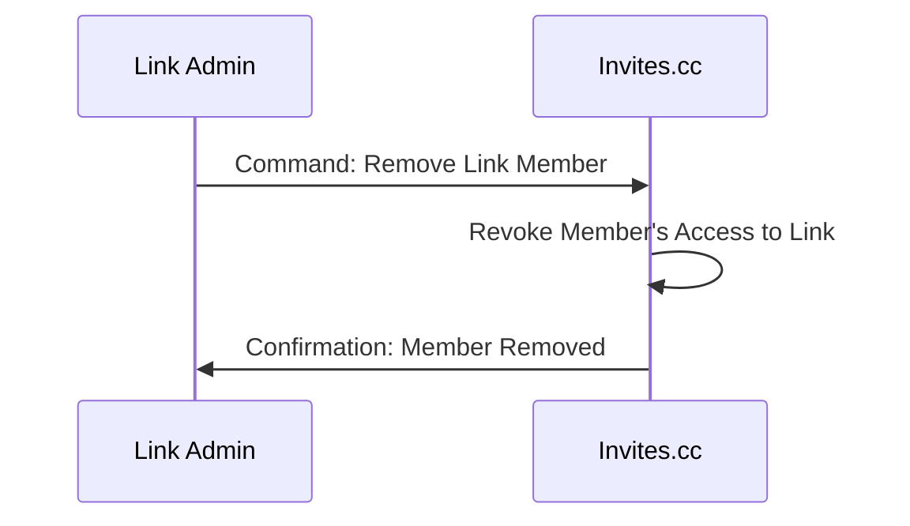

6. **Link Joining via Token**: Signed-in users can join a Link by using a valid invitation token provided by a Link Admin. Upon successful joining, they become Link Members.

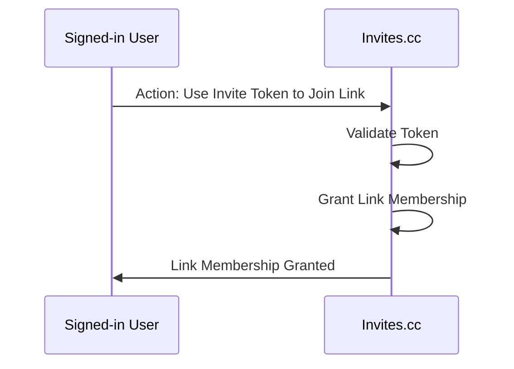

#### Event

7. **Event Creation**: Any Link Member can create a new event within a Link they are a member of. The event creator automatically becomes the Event Host. *Empowering all Link Members to organize gatherings within the shared Link space.*

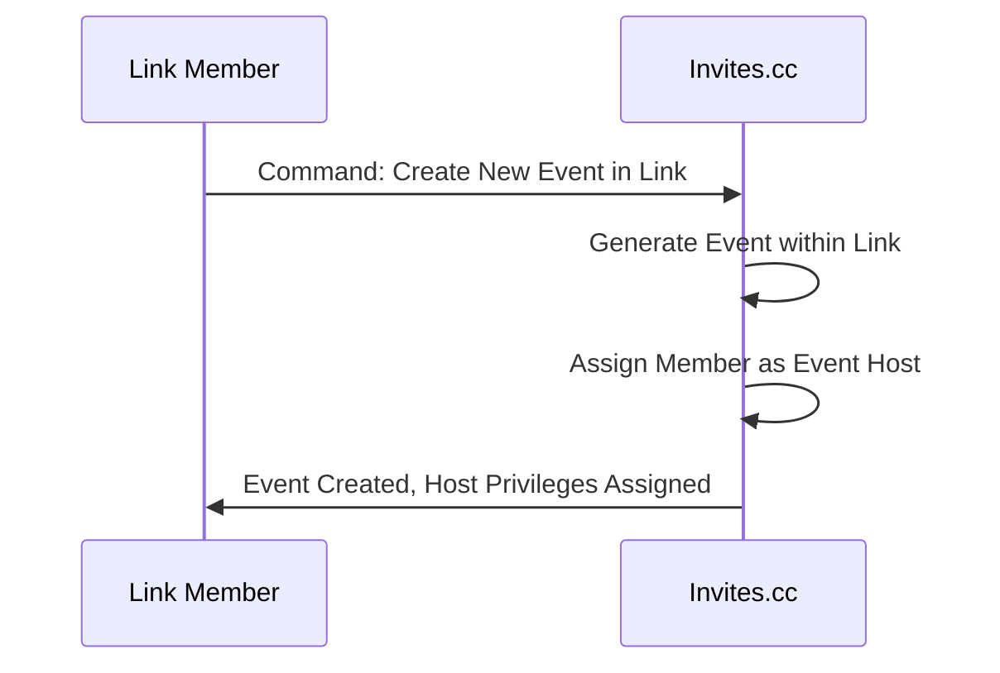

8. **Guest Invitation via Tokens**: Event Hosts and Link Admins can generate unique, revocable tokens specifically for inviting guests to an event. Guests invited via tokens **are not required to be Link members or have Invites.cc accounts**.

9. **Guest Token Revocation**: Event Hosts and Link Admins can revoke guest invitation tokens, preventing further RSVPs using those tokens.

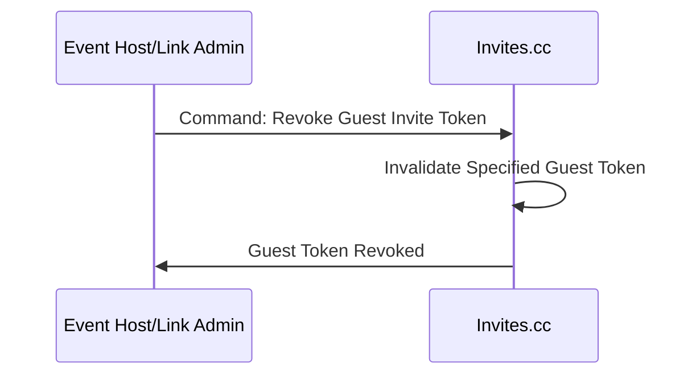

10. **List Events in a Link**: Anyone who possesses the Link ID can list and view all events created within that Link. This provides open visibility of scheduled activities within a shared space.

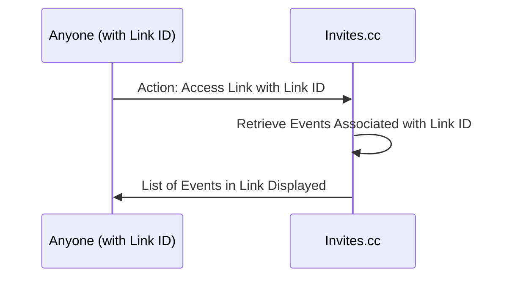

#### RSVP

11. **Link Member RSVP**: Signed-in Link Members can RSVP to events within their Link, indicating their attendance status (Going, Not Going, Maybe) and the number of additional guests they are bringing.

1. **Guest Token Holder RSVP**: Users with a valid guest invitation token can RSVP to the associated event, even if they are not Link Members. Users RSVPing via a token can provide their name (if not signed in) and RSVP status (Going, Not Going, Maybe) along with guest count.

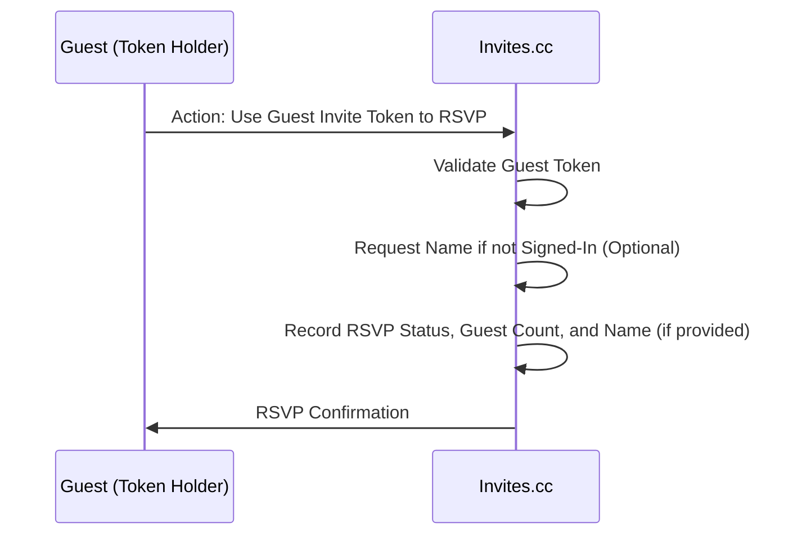

1. **RSVP Visibility**: Event Hosts and Link Admins can always view full RSVP details. They also have the option to make the list of "Going" attendees visible to all Link Members, offering a privacy control setting.

- RSVP
  - Signed-In Link Members can RSVP to any events within the Link, indicating going, not going, maybe and giving the number of additional guests they are bringing.
  - Users with a valid guest invititation token can RSVP to the specific event associated with the token even if they are not Link Members. If a user RSVPing via a token is *not* signed in, the system will request their name (for the event host to identify them). If signed in, the system uses the signed-in user's name.
  - Event Hosts and Link Admins can always view the full RSVP details for an event, including who is attending, their RSVP status, and guest counts. They have the *option* to make the list of "Going" attendees visible to all Link Members. This is a privacy control feature.

### High-Level Architecture

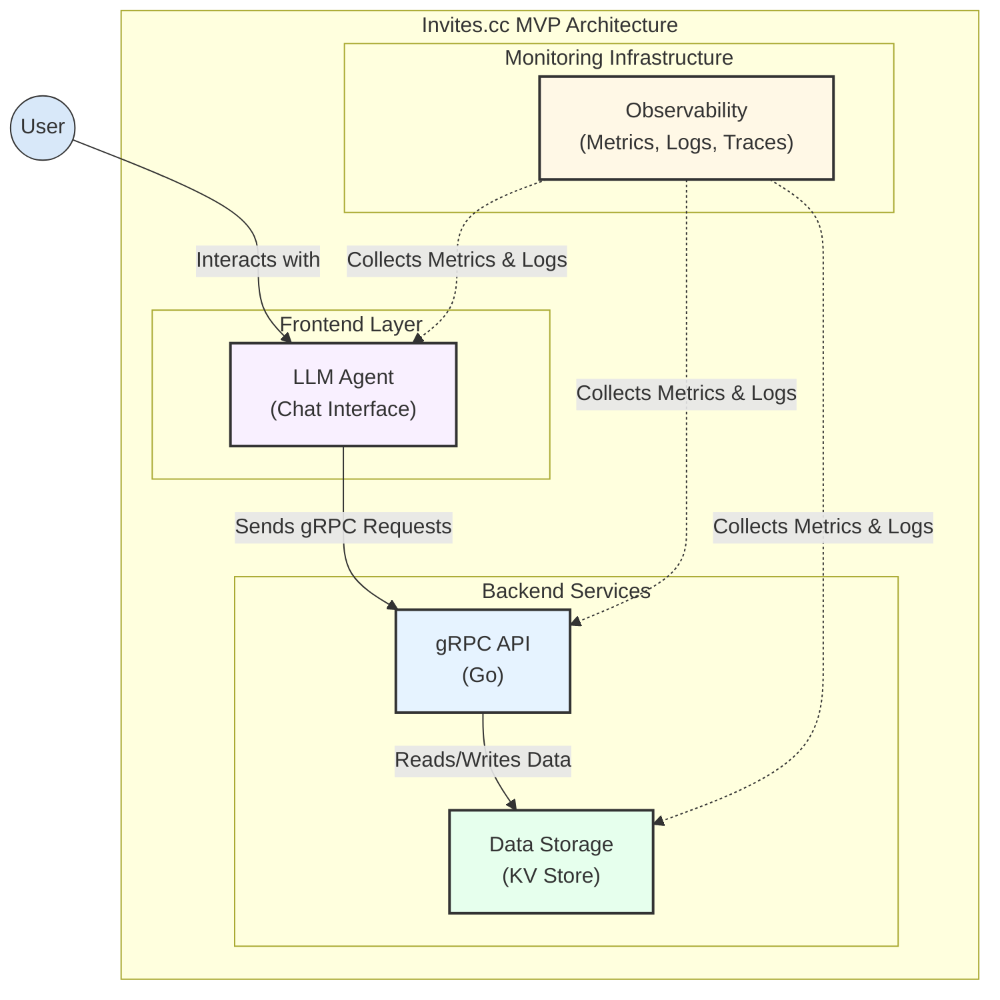
