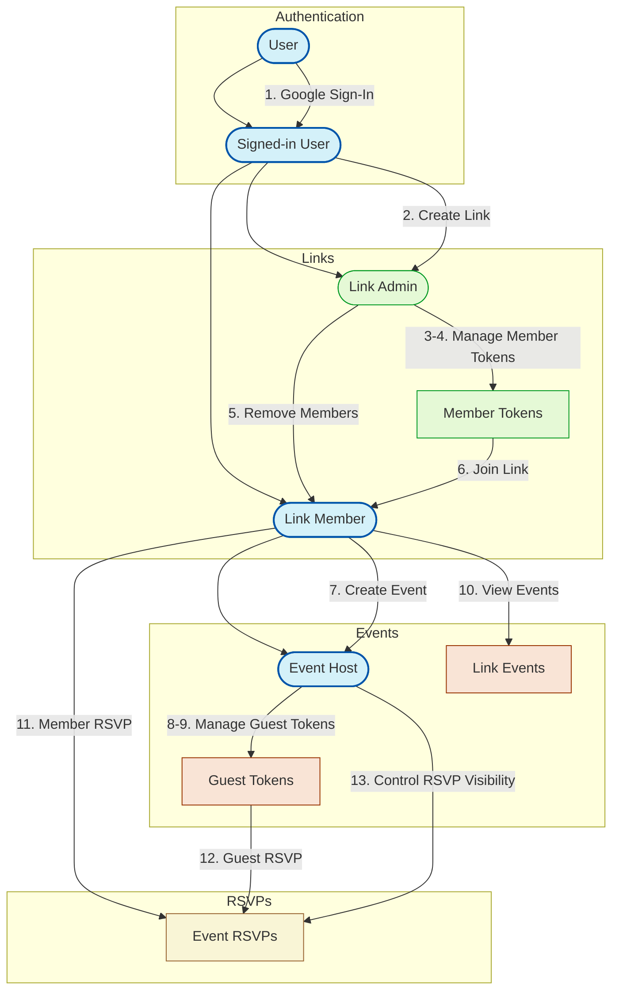

# Invites.cc

> **Less Chat. More Get-Togethers.**
>
> Tired of **organizing group hangouts** through **endless chats** and **DMs**? Invites is a purpose-built tool for bringing people together–without the noise and confusion.
> Organize in-person gatherings with friends, colleagues, teammates, classmates–any group–quickly and easily.
> Plan all activities, from casual hangouts to group outings and trips, in one place.

This document outlines the design and implementation plan for the Minimum Viable Product (MVP) of *Invites.cc*, a service designed to simplify the organization of group hangouts and events through an innovative conversational interface.

## Motivation

Organizing and coordinating group gatherings often results in an endless cycle of frustrating chats and disjointed communication, leading to:

- Fragmented Information: Event details scattered across multiple chat platforms, emails, and calendar invites.
- Chat Overhead: Endless notification chains and side conversations that obscure critical details.
- Decision Fatigue: No clear way to track who's attending, who isn't, and who's still deciding.
- Context Switching: Constantly moving between communication tools and calendar applications.

**Invites.cc** solves these pain points by providing a focused, single “Link” per group to manage event-related discussions without the noise. Members can still communicate directly with each other in the chat, but whenever they need to create a new event, adjust existing plans, or handle RSVPs, they can call on the LLM to streamline the process.

The toggle for hiding or displaying the LLM’s responses ensures that automated management details don’t clutter the conversation, while still preserving full control for users who want to see or review those interactions.

Although intentionally minimalist, this MVP is designed for growth, providing a solid foundation for future enhancements, including more advanced search capabilities, deeper integrations (such as Google Calendar), and improved scalability.

## Proposed Solution

### MVP Architecture


The MVP of Invites.cc is built around four key components:

- LLM Agent (Chat Interface): Natural language interface allowing users to create, update, and query events through simple conversation...
- gRPC API Service: Backend handling all core business logic, data management, and secure communication within the system.
- Data Store**:** Persistently stores all application data, ensuring reliability and accessibility.
- Observability**:** Implements basic logging to provide essential insights into system behavior and aid in initial development and debugging.

### User Experience

The invites.cc interface reimagines event coordination as a conversation:

- Each Link functions as a dedicated group chat where members discuss plans naturally.
- The integrated LLM agent interprets conversations to create, update, and track events...
- Users can toggle LLM visibility to either view the agent's interpreted actions or focus solely on human conversation.
- A clean timeline view surfaces upcoming events alongside the conversation.

```other
|-------------------------------------------------------|
| Les Mythos (Badminton & Basketball)           ≡ ○ ×   |
|-------------------------------------------------------|
| |---------------------|                               |
| | EVENTS              |                               |
| | Jul 27 - Basketball |                               |
| | Jul 28 - Badminton  |                               |
| |---------------------|                               |
|                                                       |
| Jul: How about basketball this Thursday?       10:30am|
|                                                       |
| Pat: I'm free on Thursday, I'll bring a friend 10:32am|
|                                                       |
| [Bot] I've created a tentative event:          10:32am|
| "Basketball" on Thu, Jul 27                           |
| Attending: Jul, Pat (+1 guest)                        |
| Reply "yes" to confirm                                |
| ◉ Show/Hide Bot                                       |
|                                                       |
| Dad: Yes, I can make it on Thursday           10:33am |
|                                                       |
| Jat: +1 for Thursday                          10:35am |
|                                                       |
| Jul: That's 4 of us plus Pat's friend, and    10:35am |
|      I know 6 more coming. We'll be 10 total.         |
|                                                       |
| Jul: Also proposing badminton on Friday       10:40am |
|                                                       |
| [Bot] Updated events:                         10:40am |
| "Basketball" - Jul, Pat (+1), Dad, Jat (+6)           |
| "Badminton" on Fri, Jul 28 - Jul, Jat                 |
| ◉ Show/Hide Bot                                       |
|                                                       |
| Message...                                   ▶        |
|-------------------------------------------------------|
```

### gRPC API Features

#### User

1. **Google Sign-In**: Users can seamlessly sign in to Invites.cc using their existing Google accounts.

#### Link

2. **Link Creation**: Signed-in users can create new Links, which serve as shared spaces for organizing events. The creator automatically becomes the Link Admin, possessing administrative privileges.
3. **Member Invitation via Tokens**: Link Admins can generate unique, revocable invitation tokens. These tokens are used to invite new members to join the Link.
4. **Member Token Revocation**: Link Admins can revoke previously generated invitation tokens. Revoked tokens become invalid, preventing further Link joins.
5. **Member Removal**: Link Admins can remove existing members from a Link, immediately restricting their access to the Link and its events.
6. **Link Joining via Token**: Signed-in users can join a Link by using a valid invitation token provided by a Link Admin. Upon successful joining, they become Link Members.

#### Event

7. **Event Creation**: Any Link Member can create a new event within a Link they are a member of. The event creator automatically becomes the Event Host. *Empowering all Link Members to organize gatherings within the shared Link space.*
8. **Guest Invitation via Tokens**: Event Hosts and Link Admins can generate unique, revocable tokens specifically for inviting guests to an event. Guests invited via tokens **are not required to be Link members or have Invites.cc accounts**.
9. **Guest Token Revocation**: Event Hosts and Link Admins can revoke guest invitation tokens, preventing further RSVPs using those tokens.
10. **List Events in a Link**: Anyone who possesses the Link ID can list and view all events created within that Link. This provides open visibility of scheduled activities within a shared space.

#### RSVP

11. **Link Member RSVP**: Signed-in Link Members can RSVP to events within their Link, indicating their attendance status (Going, Not Going, Maybe) and the number of additional guests they are bringing.
12. **Guest Token Holder RSVP**: Users with a valid guest invitation token can RSVP to the associated event, even if they are not Link Members. Users RSVPing via a token can provide their name (if not signed in) and RSVP status (Going, Not Going, Maybe) along with guest count.
13. **RSVP Visibility**: Event Hosts and Link Admins can always view full RSVP details. They also have the option to make the list of "Going" attendees visible to all Link Members, offering a privacy control setting.

---


